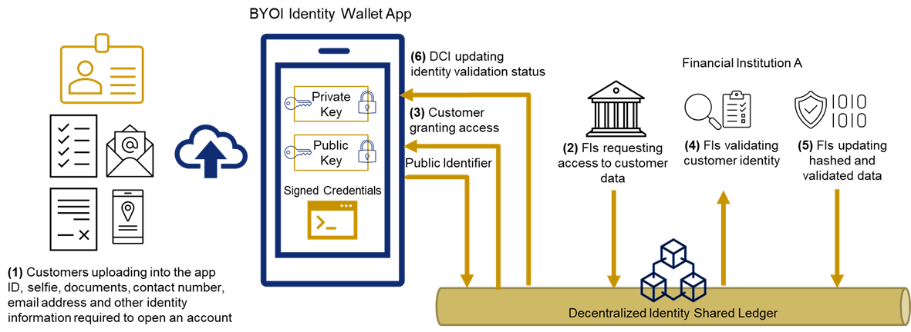
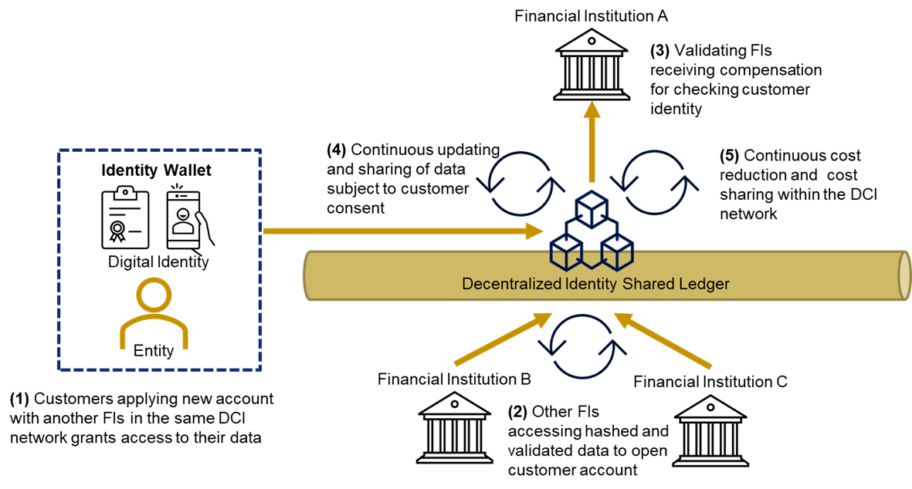

```{r setup, include=FALSE}
set.seed(1234)

knitr::opts_chunk$set(
	eval = TRUE,
	echo = TRUE,
	fig.retina = 3,
	message = FALSE,
	warning = FALSE
)
```


## 1.	Introduction to KYC, BYOI and DCI

The Monetary Authority of Singapore Notice 626 stipulates the requirements for banks to perform robust controls and prevent illegal funds from entering the country’s financial system. One of the underlying principles is for the bank to ‘exercise due diligence when dealing with customers’ which means that ‘no bank shall open or maintain an anonymous account or an account with fictious name’. This regulation highlights the importance for financial institutions to know their customers (KYC) and collect identification of including full name, unique identification number - such as identity card or passport number, address, date of birth, and nationality. For legal entities, the banks shall obtain incorporation number of business registration number, registered business address, identification and verification of beneficial owners and authorized representative who can act on the customer’s behalf (MAS, 2021).

Similarly, global banks with operations from various jurisdictions must comply with KYC requirements under different regulations such as Patriot Act and Dodd– Frank in the United States, the Money Laundering Regulations in the United Kingdom, Master Circular on KYC Norms in India (Martens, Tuyll van Serooskerken, & Steenhagen, 2017), AUSTRAC reporting requirements in Australia, and the recently published 6th Anti Money Laundering Directive in EU countries (European Commission, 2021). 

In a study conducted across six markets in Asia, it estimated that banks alone have AML compliance budget of **USD 1.5 billion** and the regulations were seen as the primary motivation for AML compliance change. The KYC processes, periodic screening and sanctions operations accounted to a third of AML compliance costs (LexisNexis Risk Solutions, 2016). (Parra Moyano & Ross, 2017) argued that the KYC process is ‘outdated and can cost up to **USD 500 million per bank**’ while (Kinyua, 2020) asserted that the KYC and onboarding processes are ‘time-consuming, complex, costly, prone to duplication and redundancy’. Lastly, from customer’s experience, the onboarding process is not optimal and far from seamless because of repetitive steps to submit the same documents for identifications when opening an account at multiple banks or event availing different services (e.g., savings account, credit card, loans, etc.) from the same bank.

Given the current state of KYC process and customer onboarding, the proposed solution recommends a self-sovereign identity (SSI) where customers can **bring their own identity (BYOI)** and related data, grant access to their identification which will be **validated by banks**, financial institutions or regtech/risktech companies in a **decentralised network** leveraging on blockchain or other distributed ledger technologies.  In the Gartner report regarding the Hype Cycle for Identity and Access Management (IAM) Technologies, both Bring Your Own Identity and Decentralized Identity (DCI) rank highest in the priority matrix where the benefit rating is said to be ‘transformational’ (Phillips, 2021). BYOI allows users to select and use third-party digital identity to access multiple digital services. It streamlines the account registration, reduces the friction, and increases the adoption of online services. Likewise, DCI allows users and entities to create and control their own digital identity.  It also increases security and convenience for users. Combining the benefits of two IAM technologies, the figure bewlow provides the overview of the proposed BYOI-DCI blockchain solution for customer onboarding.





## 2. Why BYOI and DCI/Blockchain?

The proposed solution draws its inspiration from the Singapore’s national digital identity - Singpass. It allows financial institutions and other service providers to streamline their customer onboarding by asking for explicit consent to access Myinfo via the Singpass app. However, the main difference of the proposed solution is the design of the decentralized KYC system where customers will bring their own identity, financial institutions will validate the customer’s identity, and other financial institutions will request for explicit consent from the customer to access their validated and hashed data through the distributed shared ledger. In other words, **the proposed solution relies on the trustless nature of blockchain** rather than on a centralized authority as illustrated in below:





Some of the benefits BYOI include the potential to leverage outside identities to reduce friction, increase **adoption**, **security**, and **overall user satisfaction**. The use cases are account creation to help create user account, identity attribute sharing to securely access identity with user consent, identity proofing and secure login to delegate strong authentication (Mahdi, Gaehtgens, & Care, 2019).

The key benefits of decentralized identity are: 

1. **Improved user experience (UX)** where users can easily consent and share verifiable claims through a simple smartphone application, 

2. **Tightened security** where identity proofing and verification can be established within the network, and lastly 

3. **Better privacy** where privacy preserving protocols like zero-knowledge proofs (ZKPs) can be employed to provide pseudonymity (Kelley & Mahdi, 2021). 

Furthermore, Martens, et. al (2017) highlighted additional benefits of blockchain for KYC including:

4. **Cost savings** for participating banks because they can share solutions, data, and processing standards, 

5. **Operational risks reduction** by providing consistent, standardise and automated controls, 

6. **Single source of truth** and **increased transparency** where information is stored and updated on the shared ledger, and 

7. **Regulatory reporting** since regulators can join the network to monitor the KYC activities.


## 3. Risks and Challenges

Some of the risks and challenges in implementing blockchain solution are:

1. **Design principles** whether to use public blockchain which is open for contribution, private blockchain which is open only to intended participants and requires strict security and authentication rules, or even a hybrid blockchain

2. **Data sharing and control** where client data is subject to regulatory requirements including sharing, accessing, handling, storing, and distributing data

3. **Governance policies** which outlines rules, roles and functionality, and 

4. **Technology scalability** which can support the KYC requirements for the coming years while keeping the costs at minimum (Kulkarni & Singh, 2019). 

Martens, et. al (2017) also acknowledged that some of the important challenges with blockchain for KYC are:

5.  **Blockchain regulations** since there is no common practice on how to regulate blockchain implementation and 

6. **Market adoption** because a critical mass is required for a successful KYC blockchain model. 

Gartner listed 
7. **Interoperability** among participants and technology providers and 

8. **Recoverability** of lost or stolen wallet as well as failed authentication to the wallet as top risks for Decentralised Identity. 

Lastly, 

9. **Government support** posed a huge positive risk in the success of KYC blockchain solution such as the cases of UAE’s KYC system that leverage on the country’s corporate registry and [Singapore’s POC](http://libproxy.smu.edu.sg/login?url=https://www-proquest-com.libproxy.smu.edu.sg/trade-journals/hsbc-mufg-ocbc-complete-kyc-blockchain-poc/docview/1946685762/se-2?accountid=28662) supported by Infocomm Media Development Authority (IMDA) and MAS.


## 4. Ongoing Developments

Various organizations are currently working to develop practical use of self-sovereign identity and decentralised identity  including the World Wide Web Consortium ([W3C](https://www.w3.org/2017/vc/WG/)), Decentralized Identity Foundation ([DIF](https://identity.foundation/)), [Sovrin Foundation](https://sovrin.org/sovrin-foundation-launches-test-token-for-decentralized-identity-network/), and [R3](https://www.r3.com/press-media/39-firms-complete-global-trial-of-kyc-on-corda-blockchain-platform/) Corda blockchain platform. 

There are also readily available commercial implementations such as [Kube](https://www.kube-kyc.be/en/) from Isabel group which claims that it enables banks to pool KYC data to support AML processes and uses blockchain to create trust among banks. It lists ING, BNP Paribas, KBC and Belfius among its partners.  

Finally, UAE has implemented a national KYC Blockchain Platform which enables for the exchange of verified KYC data between authorities and financial institutions. Euromoney reported on April 2021 that ‘[UAE hits its digital stride in KYC and Blockchain](http://libproxy.smu.edu.sg/login?url=https://www-proquest-com.libproxy.smu.edu.sg/trade-journals/uae-hits-digital-stride-kyc-blockchain/docview/2530859660/se-2?accountid=28662)’. Ratings agency Moody’s said in the report that the platform ‘facilitates faster and more secure onboarding’ of clients and to let members share ‘authenticated and validated digital customer data and documents through distributed technologies powered by blockchain.’


## References:

- Decentralized Identity Foundation. (n.d.). Retrieved from https://identity.foundation/

- Enterprise Innovation. (04 October, 2017). SBC, MUFG and OCBC complete KYC blockchain POC. Retrieved from https://www-proquest-com.libproxy.smu.edu.sg/docview/1946685762?accountid=28662

- Euromoney. (19 April, 2021). UAE hits its digital stride in KYC and blockchain. Retrieved from https://www-proquest-com.libproxy.smu.edu.sg/docview/2530859660?accountid=28662

- European Commission. (20 July, 2021). Anti-money laundering and countering the financing of terrorism legislative package. Retrieved from https://ec.europa.eu/: https://ec.europa.eu/info/publications/210720-anti-money-laundering-countering-financing-terrorism_en

- Kelley, M., & Mahdi, D. (18 August, 2021). Innovation Insight for Decentralized Identity and Verifiable Claims. Retrieved from Gartner: https://www.gartner.com/document/4004851

- Kinyua, D. (30 January, 2020). KYC, Client Onboarding: Leveraging Blockchain Technology. Retrieved from SSRN: https://ssrn.com/abstract=3528323

- Kube. (n.d.). Retrieved from https://www.kube-kyc.be/en/

- Kulkarni, V., & Singh, A. P. (2019). Sustainable KYC through Blockchain Technology in Global Banks. Retrieved from Analele Universității “Dunărea de Jos” Galați. Fascicula I, Economie Și Informatica Aplicata, 25(2), 34–38.: https://doi.org/10.35219/eai1584040929

- LexisNexis Risk Solutions. (2016). Uncover the True Cost of Anti-Money Laundering & KYC Compliance. Retrieved from https://www.lexisnexis.com/risk/intl/en/resources/research/true-cost-of-aml-compliance-apac-survey-report.pdf

- Mahdi, D., Gaehtgens, F., & Care, J. (23 December, 2019). Innovation Insight for Bring Your Own Identity. Retrieved from Gartner: https://www.gartner.com/document/3978687

- Martens, D., Tuyll van Serooskerken, A. v., & Steenhagen, M. (2017). Exploring the potential of blockchain for KYC. Retrieved from Journal of Digital Banking, 2(2), 123–131: https://search.library.smu.edu.sg/permalink/65SMU_INST/1ba19kd/cdi_henrystewart_journals_2397_060X_2_2_123_131_4

- MAS. (28 June, 2021). Monetary Authority of Singapore. Retrieved from https://www.mas.gov.sg/-/media/MAS-Media-Library/regulation/notices/AMLD/notice-626/MAS-Notice-626---Banks.pdf

- Parra Moyano, J., & Ross, O. (2017). KYC Optimization Using Distributed Ledger Technology. Retrieved from Business & Information Systems Engineering, 59(6), 411–423: https://doi.org/10.1007/s12599-017-0504-2

- Phillips, T. (27 July, 2021). Hype Cycle for Identity and Access Management Technologies, 2021. Retrieved from Gartner: https://www.gartner.com/interactive/hc/4004062?ref=lib

- R3. (28 June, 2018). 39 firms complete global trial of KYC on Corda blockchain platform. Retrieved from https://www.r3.com/press-media/39-firms-complete-global-trial-of-kyc-on-corda-blockchain-platform/

- Sovrin Foundation. (25 February, 2020). Sovrin Foundation Launches Test Token for Decentralized Identity Network. Retrieved from https://sovrin.org/sovrin-foundation-launches-test-token-for-decentralized-identity-network/

- World Wide Web Consortium. (n.d.). Verifiable Credentials Working Group. Retrieved from https://www.w3.org/2017/vc/WG/
